Project1
================

## R Markdown

This is an R Markdown document. Markdown is a simple formatting syntax
for authoring HTML, PDF, and MS Word documents. For more details on
using R Markdown see <http://rmarkdown.rstudio.com>.

When you click the **Knit** button a document will be generated that
includes both content as well as the output of any embedded R code
chunks within the document. You can embed an R code chunk like this:

## Alay Shah aas4449

**Introduction**

*The title of my project is Exploring Relationship between Wealth and
Public Education in the United States.*

*The two datasets I’ve chosen are statesinfo, which has information
about public high school education for each state and us\_rent\_income
dataset, which has data about average income and rent of a household in
each state.*

*The statesinfo dataset contains 8 variables: X:(state), region, pop:
population of high school students who took SAT, SATV: S.A.T. verbal
score, SATM: S.A.T math score, percent(percentage of graduating high
school students who take S.A.T), dollars(state spending on public
education in $1000 per student), pay:(average teachers salary). This
dataset was acquired through CSV file of online data.The
us\_rent\_income dataset contains 5 variables: GEOID, Name:(State),
variable (rent or income), estimated average of that variable, and
MOE(margin of error). This data was acquired from the all package
function built in r from 1995.*

*These two datasets are interesting to me because Im curious to see how
high school education effectiveness in a state is related to its overall
wealth. Im also excited to see potential associations between the two
datasets when matched on state, for example if you’re raised in a
particular state with a better education system, is it possible to
predict your overall wealth(rent&income) in life, given that you did not
move.*

``` r
#data(package= .packages(all.available = TRUE))

#install.packages("tidyr")
library(tidyr)
data("us_rent_income")

#imported read csv file into data frame statesinfo
statesinfo <- read.csv("C:\\Users\\amana\\OneDrive\\Documents\\SDS348\\Projects\\statesinfo.csv", header = TRUE)
```

**Tidy**

``` r
#statesinfo dataset was already tidy
#used pivot wider on us_rent_income only since there were multiple observ.(rent and income) of variable and they could be organized into their own column
us_rent_income1 <- us_rent_income%>%pivot_wider(names_from = variable, names_glue = "{variable}_{.value}", values_from = c(estimate,moe))
us_rent_income1
```

    ## # A tibble: 52 x 6
    ##    GEOID NAME                 income_estimate rent_estimate income_moe rent_moe
    ##    <chr> <chr>                          <dbl>         <dbl>      <dbl>    <dbl>
    ##  1 01    Alabama                        24476           747        136        3
    ##  2 02    Alaska                         32940          1200        508       13
    ##  3 04    Arizona                        27517           972        148        4
    ##  4 05    Arkansas                       23789           709        165        5
    ##  5 06    California                     29454          1358        109        3
    ##  6 08    Colorado                       32401          1125        109        5
    ##  7 09    Connecticut                    35326          1123        195        5
    ##  8 10    Delaware                       31560          1076        247       10
    ##  9 11    District of Columbia           43198          1424        681       17
    ## 10 12    Florida                        25952          1077         70        3
    ## # ... with 42 more rows

**Join/Merge**

``` r
library(tidyverse)
# renamed columns appropriately to state to allow for left join. Used left join to match on the fifty states +district of Columbia and dropped Puerto Rico, which was in us_rent_income dataset; it isnt considered a US state, had missing values for income, and its info was not provided in statesinfo dataset
#dropped GEOID from us_rent_income upon join since it didnt have meaningful info. 
us_rent_income1 <- us_rent_income1 %>% rename(state= "NAME")
statesdata <- statesinfo %>% rename(state= "X") %>% left_join(us_rent_income1[,c(-1)], "state")
statesdata
```

    ##                   state region   pop SATV SATM percent dollars pay
    ## 1               Alabama    ESC  4041  470  514       8   3.648  27
    ## 2                Alaska    PAC   550  438  476      42   7.887  43
    ## 3               Arizona    MTN  3665  445  497      25   4.231  30
    ## 4              Arkansas    WSC  2351  470  511       6   3.334  23
    ## 5            California    PAC 29760  419  484      45   4.826  39
    ## 6              Colorado    MTN  3294  456  513      28   4.809  31
    ## 7           Connecticut     NE  3287  430  471      74   7.914  43
    ## 8              Delaware     SA   666  433  470      58   6.016  35
    ## 9  District of Columbia     SA   607  409  441      68   8.210  39
    ## 10              Florida     SA 12938  418  466      44   5.154  30
    ## 11              Georgia     SA  6478  401  443      57   4.860  29
    ## 12               Hawaii    PAC  1108  404  481      52   5.008  32
    ## 13                Idaho    MTN  1007  466  502      17   3.200  25
    ## 14             Illinois    ENC 11431  466  528      16   5.062  34
    ## 15              Indiana    ENC  5544  408  459      54   5.051  32
    ## 16                 Iowa    WNC  2777  511  577       5   4.839  28
    ## 17               Kansas    WNC  2478  492  548      10   5.009  29
    ## 18             Kentucky    ESC  3685  473  521      10   4.390  29
    ## 19            Louisiana    WSC  4220  476  517       9   4.012  26
    ## 20                Maine     NE  1228  423  463      60   5.894  28
    ## 21             Maryland     SA  4781  430  478      59   6.184  38
    ## 22        Massachusetts     NE  6016  427  473      72   6.351  36
    ## 23             Michigan    ENC  9295  454  514      12   5.257  38
    ## 24            Minnesota    WNC  4375  477  542      14   5.260  33
    ## 25          Mississippi    ESC  2573  477  519       4   3.322  24
    ## 26             Missouri    WNC  5117  473  522      12   4.415  28
    ## 27              Montana    MTN   799  464  523      20   5.184  26
    ## 28             Nebraska    WNC  1578  484  546      10   4.381  26
    ## 29               Nevada    MTN  1202  434  487      24   4.564  32
    ## 30        New Hampshire     NE  1109  442  486      67   5.504  31
    ## 31           New Jersey     MA  7730  418  473      69   9.159  38
    ## 32           New Mexico    MTN  1515  480  527      12   4.446  26
    ## 33             New York     MA 17990  412  470      70   8.500  42
    ## 34       North Carolina     SA  6629  401  440      55   4.802  29
    ## 35         North Dakota    WNC   639  505  564       6   3.685  23
    ## 36                 Ohio    ENC 10847  450  499      22   5.639  32
    ## 37             Oklahoma    WSC  3146  478  523       9   3.742  24
    ## 38               Oregon    PAC  2842  439  484      49   5.291  32
    ## 39         Pennsylvania     MA 11882  420  463      64   6.534  36
    ## 40         Rhode Island     NE  1003  422  461      62   6.989  37
    ## 41       South Carolina     SA  3487  397  437      54   4.327  28
    ## 42         South Dakota    WNC   696  506  555       5   3.730  22
    ## 43            Tennessee    ESC  4877  483  525      12   3.707  28
    ## 44                Texas    WSC 16987  413  461      42   4.238  28
    ## 45                 Utah    MTN  1723  492  539       5   2.993  25
    ## 46              Vermont     NE   563  431  466      62   5.740  31
    ## 47             Virginia     SA  6187  425  470      58   5.360  32
    ## 48           Washington    PAC  4867  437  486      44   5.045  33
    ## 49        West Virginia     SA  1793  443  490      15   5.046  26
    ## 50            Wisconsin    ENC  4892  476  543      11   5.946  33
    ## 51              Wyoming    MTN   454  458  519      13   5.255  29
    ##    income_estimate rent_estimate income_moe rent_moe
    ## 1            24476           747        136        3
    ## 2            32940          1200        508       13
    ## 3            27517           972        148        4
    ## 4            23789           709        165        5
    ## 5            29454          1358        109        3
    ## 6            32401          1125        109        5
    ## 7            35326          1123        195        5
    ## 8            31560          1076        247       10
    ## 9            43198          1424        681       17
    ## 10           25952          1077         70        3
    ## 11           27024           927        106        3
    ## 12           32453          1507        218       18
    ## 13           25298           792        208        7
    ## 14           30684           952         83        3
    ## 15           27247           782        117        3
    ## 16           30002           740        143        4
    ## 17           29126           801        208        5
    ## 18           24702           713        159        4
    ## 19           25086           825        155        4
    ## 20           26841           808        187        7
    ## 21           37147          1311        152        5
    ## 22           34498          1173        199        5
    ## 23           26987           824         82        3
    ## 24           32734           906        189        4
    ## 25           22766           740        194        5
    ## 26           26999           784        113        4
    ## 27           26249           751        206        9
    ## 28           30020           773        146        4
    ## 29           29019          1017        213        6
    ## 30           33172          1052        387        9
    ## 31           35075          1249        148        4
    ## 32           24457           809        214        6
    ## 33           31057          1194         69        3
    ## 34           26482           844        111        3
    ## 35           32336           775        245        9
    ## 36           27435           764         94        2
    ## 37           26207           766        101        3
    ## 38           27389           988        146        4
    ## 39           28923           885        119        3
    ## 40           30210           957        259        6
    ## 41           25454           836        123        4
    ## 42           28821           696        276        7
    ## 43           25453           808        102        4
    ## 44           28063           952        110        2
    ## 45           27928           948        239        6
    ## 46           29351           945        361       11
    ## 47           32545          1166        202        5
    ## 48           32318          1120        113        4
    ## 49           23707           681        203        6
    ## 50           29868           813        135        3
    ## 51           30854           828        342       11

**Summary Statistics**

``` r
library(dplyr)

#Used 6 dplyr functions 

#I was interested in exploring Texas metrics and other border states. Below shows filtering for only western south central states and arranging by percent(percentage of graduating high school students who take S.A.T)
#As expected, Texas compared to other states in the region who a significantly higher percentage 
statesdata %>% filter(region =="WSC") %>% arrange(desc(percent))
```

    ##       state region   pop SATV SATM percent dollars pay income_estimate
    ## 1     Texas    WSC 16987  413  461      42   4.238  28           28063
    ## 2 Louisiana    WSC  4220  476  517       9   4.012  26           25086
    ## 3  Oklahoma    WSC  3146  478  523       9   3.742  24           26207
    ## 4  Arkansas    WSC  2351  470  511       6   3.334  23           23789
    ##   rent_estimate income_moe rent_moe
    ## 1           952        110        2
    ## 2           825        155        4
    ## 3           766        101        3
    ## 4           709        165        5

``` r
#used group_by on regions within US and found mean rent estimate of those regions
statesdata %>% group_by(region) %>% summarize(mean_rent_stimate = mean(rent_estimate)) 
```

    ## # A tibble: 9 x 2
    ##   region mean_rent_stimate
    ## * <chr>              <dbl>
    ## 1 ENC                 827 
    ## 2 ESC                 752 
    ## 3 MA                 1109.
    ## 4 MTN                 905.
    ## 5 NE                 1010.
    ## 6 PAC                1235.
    ## 7 SA                 1038 
    ## 8 WNC                 782.
    ## 9 WSC                 813

``` r
#used mutate to make a new column for average SAT Score
statesdata <- statesdata %>% mutate(SAT_avg = (SATV+SATM)/2)

#used select for particular columns and arranged from incr. to decr. SAT avg; wanted to see if there was a direct relationship to income_estimate and pay
statesdata %>% select(state, income_estimate, SAT_avg, pay) %>%  arrange(desc(SAT_avg))
```

    ##                   state income_estimate SAT_avg pay
    ## 1                  Iowa           30002   544.0  28
    ## 2          North Dakota           32336   534.5  23
    ## 3          South Dakota           28821   530.5  22
    ## 4                Kansas           29126   520.0  29
    ## 5                  Utah           27928   515.5  25
    ## 6              Nebraska           30020   515.0  26
    ## 7             Minnesota           32734   509.5  33
    ## 8             Wisconsin           29868   509.5  33
    ## 9             Tennessee           25453   504.0  28
    ## 10           New Mexico           24457   503.5  26
    ## 11             Oklahoma           26207   500.5  24
    ## 12          Mississippi           22766   498.0  24
    ## 13             Missouri           26999   497.5  28
    ## 14             Illinois           30684   497.0  34
    ## 15             Kentucky           24702   497.0  29
    ## 16            Louisiana           25086   496.5  26
    ## 17              Montana           26249   493.5  26
    ## 18              Alabama           24476   492.0  27
    ## 19             Arkansas           23789   490.5  23
    ## 20              Wyoming           30854   488.5  29
    ## 21             Colorado           32401   484.5  31
    ## 22                Idaho           25298   484.0  25
    ## 23             Michigan           26987   484.0  38
    ## 24                 Ohio           27435   474.5  32
    ## 25              Arizona           27517   471.0  30
    ## 26        West Virginia           23707   466.5  26
    ## 27        New Hampshire           33172   464.0  31
    ## 28               Oregon           27389   461.5  32
    ## 29           Washington           32318   461.5  33
    ## 30               Nevada           29019   460.5  32
    ## 31               Alaska           32940   457.0  43
    ## 32             Maryland           37147   454.0  38
    ## 33           California           29454   451.5  39
    ## 34             Delaware           31560   451.5  35
    ## 35          Connecticut           35326   450.5  43
    ## 36        Massachusetts           34498   450.0  36
    ## 37              Vermont           29351   448.5  31
    ## 38             Virginia           32545   447.5  32
    ## 39           New Jersey           35075   445.5  38
    ## 40                Maine           26841   443.0  28
    ## 41               Hawaii           32453   442.5  32
    ## 42              Florida           25952   442.0  30
    ## 43         Pennsylvania           28923   441.5  36
    ## 44         Rhode Island           30210   441.5  37
    ## 45             New York           31057   441.0  42
    ## 46                Texas           28063   437.0  28
    ## 47              Indiana           27247   433.5  32
    ## 48 District of Columbia           43198   425.0  39
    ## 49              Georgia           27024   422.0  29
    ## 50       North Carolina           26482   420.5  29
    ## 51       South Carolina           25454   417.0  28

``` r
#Next I began calculating summary statistics for my numeric variables overall and after grouping with my categorical variable region. A correlation matrix was made for the numerical variables

#Summary Statistics of population
statesdata %>% 
  summarize(mean_pop = mean(pop), 
            sd_pop = sd(pop),
            var= var(pop),
            IQR = IQR(pop), 
            n_rows = n(),
            quants = quantile(pop, probs=c(.1, .25, .5, .75, .90)),
            min = min(pop),
            max= max(pop),
            n_pop = n_distinct(pop)) 
```

    ##   mean_pop   sd_pop      var  IQR n_rows quants min   max n_pop
    ## 1 4876.647 5439.203 29584926 4565     51    666 454 29760    51
    ## 2 4876.647 5439.203 29584926 4565     51   1215 454 29760    51
    ## 3 4876.647 5439.203 29584926 4565     51   3294 454 29760    51
    ## 4 4876.647 5439.203 29584926 4565     51   5780 454 29760    51
    ## 5 4876.647 5439.203 29584926 4565     51  11431 454 29760    51

``` r
#Found Summary Statistics by subgroup of categorical variable region
#used group by to find the groups of data, and calculated mean and SD population per region
pop_data_grouped<- statesdata %>% 
  group_by(region)%>%
  summarize(mean_pop = mean(pop), 
            sd_pop = sd(pop),
            var_pop= var(pop),
            IQR = IQR(pop), 
            n_rows = n(),
            quant_50_pop = quantile(pop, probs=c(0.5)),
            min = min(pop),
            max= max(pop),
            n_pop = n_distinct(pop))

#Summary Statistics of SAT Verbal score
statesdata %>% 
  summarize(mean_SATV = mean(SATV), 
            sd_SATV = sd(SATV),
            var= var(SATV),
            IQR = IQR(SATV), 
            n_rows = n(),
            quants = quantile(SATV, probs=c(.1, .25, .5, .75, .90)),
            min = min(SATV),
            max= max(SATV),
            n_SATV = n_distinct(SATV)) 
```

    ##   mean_SATV  sd_SATV      var IQR n_rows quants min max n_SATV
    ## 1  448.1569 30.82101 949.9349  52     51  409.0 397 511     42
    ## 2  448.1569 30.82101 949.9349  52     51  422.5 397 511     42
    ## 3  448.1569 30.82101 949.9349  52     51  443.0 397 511     42
    ## 4  448.1569 30.82101 949.9349  52     51  474.5 397 511     42
    ## 5  448.1569 30.82101 949.9349  52     51  484.0 397 511     42

``` r
#Found Summary Statistics by subgroup of categorical variable region
#used group by to find the groups of data, and calculated mean and SD SAT Verbal score per region
SATV_data_grouped<- statesdata %>% 
  group_by(region)%>%
  summarize(mean_SATV = mean(SATV), 
            sd_SATV = sd(SATV),
            var_SATV= var(SATV),
            IQR = IQR(SATV), 
            n_rows = n(),
            quant_50_SATV = quantile(SATV, probs=c(0.5)),
            min = min(SATV),
            max= max(SATV),
            n_SATV = n_distinct(SATV))
#Summary Statistics of SAT Math score
statesdata %>% 
  summarize(mean_SATM = mean(SATM), 
            sd_SATM = sd(SATM),
            var= var(SATM),
            IQR = IQR(SATM), 
            n_rows = n(),
            quants = quantile(SATM, probs=c(.1, .25, .5, .75, .90)),
            min = min(SATM),
            max= max(SATM),
            n_SATV = n_distinct(SATM)) 
```

    ##   mean_SATM  sd_SATM      var  IQR n_rows quants min max n_SATV
    ## 1  497.3922 34.56882 1195.003 52.5     51  461.0 437 577     40
    ## 2  497.3922 34.56882 1195.003 52.5     51  470.0 437 577     40
    ## 3  497.3922 34.56882 1195.003 52.5     51  490.0 437 577     40
    ## 4  497.3922 34.56882 1195.003 52.5     51  522.5 437 577     40
    ## 5  497.3922 34.56882 1195.003 52.5     51  543.0 437 577     40

``` r
#Found Summary Statistics by subgroup of categorical variable region
#used group by to find the groups of data, and calculated mean and SD SAT Math score per region
SATM_data_grouped<- statesdata %>% 
  group_by(region)%>%
  summarize(mean_SATM = mean(SATM), 
            sd_SATM = sd(SATM),
            var_SATM= var(SATM),
            IQR = IQR(SATM), 
            n_rows = n(),
            quant_50_SATM = quantile(SATM, probs=c(0.5)),
            min = min(SATM),
            max= max(SATM),
            n_SATM = n_distinct(SATM))

#Summary Statistics of percent(percentage of graduating high school students who take S.A.T)
statesdata %>% 
  summarize(mean_percent = mean(percent), 
            sd_pop = sd(percent),
            var= var(percent),
            IQR = IQR(percent), 
            n_rows = n(),
            quants = quantile(percent, probs=c(.1, .25, .5, .75, .90)),
            min = min(percent),
            max= max(percent),
            n_pop = n_distinct(percent)) 
```

    ##   mean_percent   sd_pop      var IQR n_rows quants min max n_pop
    ## 1      33.7451 24.07392 579.5537  46     51    6.0   4  74    37
    ## 2      33.7451 24.07392 579.5537  46     51   11.5   4  74    37
    ## 3      33.7451 24.07392 579.5537  46     51   25.0   4  74    37
    ## 4      33.7451 24.07392 579.5537  46     51   57.5   4  74    37
    ## 5      33.7451 24.07392 579.5537  46     51   67.0   4  74    37

``` r
#Found Summary Statistics by subgroup of categorical variable region
#used group by to find the groups of data, and calculated mean and SD percent per region
percent_data_grouped<- statesdata %>% 
  group_by(region)%>%
  summarize(mean_percent = mean(percent), 
            sd_percent = sd(percent),
            var_percent= var(percent),
            IQR = IQR(percent), 
            n_rows = n(),
            quants_50_percent = quantile(percent, probs=c(0.5)),
            min = min(percent),
            max= max(percent),
            n_percent = n_distinct(percent))
#Summary Statistics of  dollars(state spending on public education in $1000 per student)
statesdata %>% 
  summarize(mean_dollars = mean(dollars), 
            sd_dollars = sd(dollars),
            var= var(dollars),
            IQR = IQR(dollars), 
            n_rows = n(),
            quants = quantile(dollars, probs=c(.1, .25, .5, .75, .90)),
            min = min(dollars),
            max= max(dollars),
            n_dollars = n_distinct(dollars)) 
```

    ##   mean_dollars sd_dollars      var    IQR n_rows quants   min   max n_dollars
    ## 1      5.17549   1.376166 1.893833 1.3355     51 3.6850 2.993 9.159        51
    ## 2      5.17549   1.376166 1.893833 1.3355     51 4.3540 2.993 9.159        51
    ## 3      5.17549   1.376166 1.893833 1.3355     51 5.0450 2.993 9.159        51
    ## 4      5.17549   1.376166 1.893833 1.3355     51 5.6895 2.993 9.159        51
    ## 5      5.17549   1.376166 1.893833 1.3355     51 6.9890 2.993 9.159        51

``` r
#Found Summary Statistics by subgroup of categorical variable region
#used group by to find the groups of data, and calculated mean and SD dollars per region
dollars_data_grouped <- statesdata %>% 
  group_by(region)%>%
  summarize(mean_dollars = mean(dollars), 
            sd_dollars = sd(dollars),
            var_dollars= var(dollars),
            IQR = IQR(dollars), 
            n_rows = n(),
            quants_50_dollars = quantile(dollars, probs=c(0.5)),
            min = min(dollars),
            max= max(dollars),
            n_dollars = n_distinct(dollars))
#Summary Statistics of pay:(average teachers salary)
statesdata %>% 
  summarize(mean_pay = mean(pay), 
            sd_pay = sd(pay),
            var= var(pay),
            IQR = IQR(pay), 
            n_rows = n(),
            quants = quantile(pay, probs=c(.1, .25, .5, .75, .90)),
            min = min(pay),
            max= max(pay),
            n_pay = n_distinct(pay)) 
```

    ##   mean_pay   sd_pay      var IQR n_rows quants min max n_pay
    ## 1 30.94118 5.308151 28.17647   6     51   25.0  22  43    20
    ## 2 30.94118 5.308151 28.17647   6     51   27.5  22  43    20
    ## 3 30.94118 5.308151 28.17647   6     51   30.0  22  43    20
    ## 4 30.94118 5.308151 28.17647   6     51   33.5  22  43    20
    ## 5 30.94118 5.308151 28.17647   6     51   38.0  22  43    20

``` r
#Found Summary Statistics by subgroup of categorical variable region
#used group by to find the groups of data, and calculated mean and SD pay region
pay_data_grouped <- statesdata %>% 
  group_by(region)%>%
  summarize(mean_pay = mean(pay), 
            sd_pay = sd(pay),
            var_pay= var(pay),
            IQR = IQR(pay), 
            n_rows = n(),
            quants_50_pay = quantile(pay, probs=c(0.5)),
            min = min(pay),
            max= max(pay),
            n_pay = n_distinct(pay))

#Summary Statistics of income estimate
statesdata %>% 
  summarize(mean_income_estimate = mean(income_estimate), 
            sd_income_estimate = sd(income_estimate),
            var= var(income_estimate),
            IQR = IQR(income_estimate), 
            n_rows = n(),
            quants = quantile(income_estimate, probs=c(.1, .25, .5, .75, .90)),
            min = min(income_estimate),
            max= max(income_estimate),
            n_income_estimate = n_distinct(income_estimate)) 
```

    ##   mean_income_estimate sd_income_estimate      var    IQR n_rows  quants   min
    ## 1             29188.24           3918.746 15356570 5573.5     51 24702.0 22766
    ## 2             29188.24           3918.746 15356570 5573.5     51 26365.5 22766
    ## 3             29188.24           3918.746 15356570 5573.5     51 28923.0 22766
    ## 4             29188.24           3918.746 15356570 5573.5     51 31939.0 22766
    ## 5             29188.24           3918.746 15356570 5573.5     51 33172.0 22766
    ##     max n_income_estimate
    ## 1 43198                51
    ## 2 43198                51
    ## 3 43198                51
    ## 4 43198                51
    ## 5 43198                51

``` r
#Found Summary Statistics by subgroup of categorical variable region
#used group by to find the groups of data, and calculated mean and SD income estimate region
income_estimate_data_grouped <- statesdata %>% 
  group_by(region)%>%
  summarize(mean_income_estimate = mean(income_estimate), 
            sd_income_estimate = sd(income_estimate),
            var_income_estimate= var(income_estimate),
            IQR = IQR(income_estimate), 
            n_rows = n(),
            quants_50_income_estimate = quantile(income_estimate, probs=c(0.5)),
            min = min(income_estimate),
            max= max(income_estimate),
            n_income_estimate = n_distinct(income_estimate))
#Summary Statistics of rent estimate
statesdata %>% 
  summarize(mean_rent_estimate = mean(rent_estimate), 
            sd_rent_estimate = sd(rent_estimate),
            var= var(rent_estimate),
            IQR = IQR(rent_estimate), 
            n_rows = n(),
            quants = quantile(rent_estimate, probs=c(.1, .25, .5, .75, .90)),
            min = min(rent_estimate),
            max= max(rent_estimate),
            n_rent_estimate = n_distinct(rent_estimate)) 
```

    ##   mean_rent_estimate sd_rent_estimate      var   IQR n_rows quants min  max
    ## 1           941.4314         204.1532 41678.53 293.5     51  740.0 681 1507
    ## 2           941.4314         204.1532 41678.53 293.5     51  783.0 681 1507
    ## 3           941.4314         204.1532 41678.53 293.5     51  885.0 681 1507
    ## 4           941.4314         204.1532 41678.53 293.5     51 1076.5 681 1507
    ## 5           941.4314         204.1532 41678.53 293.5     51 1200.0 681 1507
    ##   n_rent_estimate
    ## 1              48
    ## 2              48
    ## 3              48
    ## 4              48
    ## 5              48

``` r
#Found Summary Statistics by subgroup of categorical variable region
#used group by to find the groups of data, and calculated mean and SD rent estimate region
rent_estimate_data_grouped <- statesdata %>% 
  group_by(region)%>%
  summarize(mean_rent_estimate = mean(rent_estimate), 
            sd_rent_estimate = sd(rent_estimate),
            var_rent_estimate= var(rent_estimate),
            IQR = IQR(rent_estimate), 
            n_rows = n(),
            quants_50_rent_estimate = quantile(rent_estimate, probs=c(0.5)),
            min = min(rent_estimate),
            max= max(rent_estimate),
            n_rent_estimate = n_distinct(rent_estimate))

#Summary Statistics of income moe (Margin of Error)
statesdata %>% 
  summarize(mean_income_moe = mean(income_moe), 
            sd_income_moe = sd(income_moe),
            var= var(income_moe),
            IQR = IQR(income_moe), 
            n_rows = n(),
            quants = quantile(income_moe, probs=c(.1, .25, .5, .75, .90)),
            min = min(income_moe),
            max= max(income_moe),
            n_income_moe = n_distinct(income_moe)) 
```

    ##   mean_income_moe sd_income_moe      var  IQR n_rows quants min max
    ## 1        187.1569      110.7603 12267.85 97.5     51  101.0  69 681
    ## 2        187.1569      110.7603 12267.85 97.5     51  113.0  69 681
    ## 3        187.1569      110.7603 12267.85 97.5     51  155.0  69 681
    ## 4        187.1569      110.7603 12267.85 97.5     51  210.5  69 681
    ## 5        187.1569      110.7603 12267.85 97.5     51  276.0  69 681
    ##   n_income_moe
    ## 1           46
    ## 2           46
    ## 3           46
    ## 4           46
    ## 5           46

``` r
#Found Summary Statistics by subgroup of categorical variable region
#used group by to find the groups of data, and calculated mean and SD income moe (Margin of Error) estimate region
income_moe_data_grouped <- statesdata %>% 
  group_by(region)%>%
  summarize(mean_income_moe = mean(income_moe), 
            sd_income_moe = sd(income_moe),
            var_income_moe= var(income_moe),
            IQR = IQR(income_moe), 
            n_rows = n(),
            quants_50_income_moe = quantile(income_moe, probs=c(0.5)),
            min = min(income_moe),
            max= max(income_moe),
            n_income_moe = n_distinct(income_moe))

#Summary Statistics of rent moe (Margin of Error)
statesdata %>% 
  summarize(mean_rent_moe = mean(rent_moe), 
            sd_rent_moe = sd(rent_moe),
            var= var(rent_moe),
            IQR = IQR(rent_moe), 
            n_rows = n(),
            quants = quantile(rent_moe, probs=c(.1, .25, .5, .75, .90)),
            min = min(rent_moe),
            max= max(rent_moe),
            n_rent_moe = n_distinct(rent_moe)) 
```

    ##   mean_rent_moe sd_rent_moe      var IQR n_rows quants min max n_rent_moe
    ## 1      5.607843    3.458777 11.96314   3     51      3   2  18         12
    ## 2      5.607843    3.458777 11.96314   3     51      3   2  18         12
    ## 3      5.607843    3.458777 11.96314   3     51      4   2  18         12
    ## 4      5.607843    3.458777 11.96314   3     51      6   2  18         12
    ## 5      5.607843    3.458777 11.96314   3     51     10   2  18         12

``` r
#Found Summary Statistics by subgroup of categorical variable region
#used group by to find the groups of data, and calculated mean and SD rent moe (Margin of Error) estimate region
rent_moe_data_grouped <- statesdata %>% 
  group_by(region)%>%
  summarize(mean_rent_moe = mean(rent_moe), 
            sd_rent_moe = sd(rent_moe),
            var_rent_moe= var(rent_moe),
            IQR = IQR(rent_moe), 
            n_rows = n(),
            quants_50_rent_moe = quantile(rent_moe, probs=c(0.5)),
            min = min(rent_moe),
            max= max(rent_moe),
            n_rent_moe = n_distinct(rent_moe))
#Summary Statistics of SAT Avg score
statesdata %>% 
  summarize(mean_SAT_avg = mean(SAT_avg), 
            sd_SAT_avg = sd(SAT_avg),
            var= var(SAT_avg),
            IQR = IQR(SAT_avg), 
            n_rows = n(),
            quants = quantile(SAT_avg, probs=c(.1, .25, .5, .75, .90)),
            min = min(SAT_avg),
            max= max(SAT_avg),
            n_SAT_avg = n_distinct(SAT_avg)) 
```

    ##   mean_SAT_avg sd_SAT_avg      var   IQR n_rows quants min max n_SAT_avg
    ## 1     472.7745   32.38415 1048.733 50.75     51 437.00 417 544        45
    ## 2     472.7745   32.38415 1048.733 50.75     51 446.50 417 544        45
    ## 3     472.7745   32.38415 1048.733 50.75     51 466.50 417 544        45
    ## 4     472.7745   32.38415 1048.733 50.75     51 497.25 417 544        45
    ## 5     472.7745   32.38415 1048.733 50.75     51 515.00 417 544        45

``` r
#Found Summary Statistics by subgroup of categorical variable region
#used group by to find the groups of data, and calculated mean and SD SAT_avg score per region
SAT_avg_data_grouped <- statesdata %>% 
  group_by(region)%>%
  summarize(mean_SAT_avg = mean(SAT_avg), 
            sd_SAT_avg = sd(SAT_avg),
            var_SAT_avg= var(SAT_avg),
            IQR = IQR(SAT_avg), 
            n_rows = n(),
            quants_50_SAT_avg = quantile(SAT_avg, probs=c(0.5)),
            min = min(SAT_avg),
            max= max(SAT_avg),
            n_SAT_avg = n_distinct(SAT_avg))


#cor function used for pairwise complete observation
# created correlation matrix for all numeric variables
states_num <- statesdata %>%
  select_if(is.numeric) 
correlation_matrix_states<- cor(states_num, use = "pairwise.complete.obs")
correlation_matrix_states
```

    ##                         pop        SATV       SATM    percent    dollars
    ## pop              1.00000000 -0.33810281 -0.2300418  0.2100687  0.1436745
    ## SATV            -0.33810281  1.00000000  0.9620359 -0.8627954 -0.5268313
    ## SATM            -0.23004177  0.96203585  1.0000000 -0.8581495 -0.4844477
    ## percent          0.21006866 -0.86279535 -0.8581495  1.0000000  0.7111474
    ## dollars          0.14367446 -0.52683127 -0.4844477  0.7111474  1.0000000
    ## pay              0.36772437 -0.55592383 -0.4853306  0.6630098  0.8476737
    ## income_estimate -0.03102508 -0.26788385 -0.2065983  0.5291497  0.6703931
    ## rent_estimate    0.27633142 -0.59151710 -0.5025881  0.6731410  0.5817228
    ## income_moe      -0.48680243 -0.03152112 -0.1194568  0.1834212  0.3148851
    ## rent_moe        -0.50299724 -0.10747590 -0.1122657  0.1875673  0.2271323
    ## SAT_avg         -0.28367185  0.98933362  0.9915304 -0.8685953 -0.5092655
    ##                        pay income_estimate rent_estimate  income_moe   rent_moe
    ## pop              0.3677244     -0.03102508     0.2763314 -0.48680243 -0.5029972
    ## SATV            -0.5559238     -0.26788385    -0.5915171 -0.03152112 -0.1074759
    ## SATM            -0.4853306     -0.20659832    -0.5025881 -0.11945682 -0.1122657
    ## percent          0.6630098      0.52914967     0.6731410  0.18342116  0.1875673
    ## dollars          0.8476737      0.67039310     0.5817228  0.31488510  0.2271323
    ## pay              1.0000000      0.64641326     0.7107713  0.16724603  0.1032952
    ## income_estimate  0.6464133      1.00000000     0.7409009  0.50724342  0.4489924
    ## rent_estimate    0.7107713      0.74090086     1.0000000  0.28475448  0.4030086
    ## income_moe       0.1672460      0.50724342     0.2847545  1.00000000  0.8233009
    ## rent_moe         0.1032952      0.44899245     0.4030086  0.82330094  1.0000000
    ## SAT_avg         -0.5235808     -0.23774457    -0.5497293 -0.07875757 -0.1110637
    ##                     SAT_avg
    ## pop             -0.28367185
    ## SATV             0.98933362
    ## SATM             0.99153041
    ## percent         -0.86859532
    ## dollars         -0.50926549
    ## pay             -0.52358084
    ## income_estimate -0.23774457
    ## rent_estimate   -0.54972932
    ## income_moe      -0.07875757
    ## rent_moe        -0.11106371
    ## SAT_avg          1.00000000

``` r
#Easy to Read Tables using Kable
library(knitr)
library(kableExtra)

# Made 3 kable tables (split the numerical variables grouped by region accordingly)

#used cbind to combine some of the different data frames that were already grouped by region
statesdata_grouped <- cbind(pop_data_grouped, SAT_avg_data_grouped, income_estimate_data_grouped, rent_estimate_data_grouped) 
#selected only columns that included mean, sd ,quantile at the 50 percent mark due to size limitations
#applied kable function to organize its output in Rmd file and styled with striped
statesdata_grouped %>% select(1:3, 7, 12:13, 17) %>% kable(caption = "Summary Statistics of Population&SAT_avg,  per Region ") %>% kable_styling(bootstrap_options = "striped")
```

<table class="table table-striped" style="margin-left: auto; margin-right: auto;">
<caption>
Summary Statistics of Population&SAT\_avg, per Region
</caption>
<thead>
<tr>
<th style="text-align:left;">
region
</th>
<th style="text-align:right;">
mean\_pop
</th>
<th style="text-align:right;">
sd\_pop
</th>
<th style="text-align:right;">
quant\_50\_pop
</th>
<th style="text-align:right;">
mean\_SAT\_avg
</th>
<th style="text-align:right;">
sd\_SAT\_avg
</th>
<th style="text-align:right;">
quants\_50\_SAT\_avg
</th>
</tr>
</thead>
<tbody>
<tr>
<td style="text-align:left;">
ENC
</td>
<td style="text-align:right;">
8401.800
</td>
<td style="text-align:right;">
3018.2188
</td>
<td style="text-align:right;">
9295.0
</td>
<td style="text-align:right;">
479.7000
</td>
<td style="text-align:right;">
29.014221
</td>
<td style="text-align:right;">
484.00
</td>
</tr>
<tr>
<td style="text-align:left;">
ESC
</td>
<td style="text-align:right;">
3794.000
</td>
<td style="text-align:right;">
955.0951
</td>
<td style="text-align:right;">
3863.0
</td>
<td style="text-align:right;">
497.7500
</td>
<td style="text-align:right;">
4.924429
</td>
<td style="text-align:right;">
497.50
</td>
</tr>
<tr>
<td style="text-align:left;">
MA
</td>
<td style="text-align:right;">
12534.000
</td>
<td style="text-align:right;">
5160.9813
</td>
<td style="text-align:right;">
11882.0
</td>
<td style="text-align:right;">
442.6667
</td>
<td style="text-align:right;">
2.466441
</td>
<td style="text-align:right;">
441.50
</td>
</tr>
<tr>
<td style="text-align:left;">
MTN
</td>
<td style="text-align:right;">
1707.375
</td>
<td style="text-align:right;">
1166.7384
</td>
<td style="text-align:right;">
1358.5
</td>
<td style="text-align:right;">
487.6250
</td>
<td style="text-align:right;">
17.317930
</td>
<td style="text-align:right;">
486.50
</td>
</tr>
<tr>
<td style="text-align:left;">
NE
</td>
<td style="text-align:right;">
2201.000
</td>
<td style="text-align:right;">
2097.1916
</td>
<td style="text-align:right;">
1168.5
</td>
<td style="text-align:right;">
449.5833
</td>
<td style="text-align:right;">
7.983838
</td>
<td style="text-align:right;">
449.25
</td>
</tr>
<tr>
<td style="text-align:left;">
PAC
</td>
<td style="text-align:right;">
7825.400
</td>
<td style="text-align:right;">
12377.0755
</td>
<td style="text-align:right;">
2842.0
</td>
<td style="text-align:right;">
454.8000
</td>
<td style="text-align:right;">
8.012490
</td>
<td style="text-align:right;">
457.00
</td>
</tr>
<tr>
<td style="text-align:left;">
SA
</td>
<td style="text-align:right;">
4840.667
</td>
<td style="text-align:right;">
3868.6955
</td>
<td style="text-align:right;">
4781.0
</td>
<td style="text-align:right;">
438.4444
</td>
<td style="text-align:right;">
17.773654
</td>
<td style="text-align:right;">
442.00
</td>
</tr>
<tr>
<td style="text-align:left;">
WNC
</td>
<td style="text-align:right;">
2522.857
</td>
<td style="text-align:right;">
1732.3246
</td>
<td style="text-align:right;">
2478.0
</td>
<td style="text-align:right;">
521.5714
</td>
<td style="text-align:right;">
15.920188
</td>
<td style="text-align:right;">
520.00
</td>
</tr>
<tr>
<td style="text-align:left;">
WSC
</td>
<td style="text-align:right;">
6676.000
</td>
<td style="text-align:right;">
6916.5305
</td>
<td style="text-align:right;">
3683.0
</td>
<td style="text-align:right;">
481.1250
</td>
<td style="text-align:right;">
29.702343
</td>
<td style="text-align:right;">
493.50
</td>
</tr>
</tbody>
</table>

``` r
statesdata_grouped %>% select(22:23, 27, 32:33, 37) %>% kable(caption = "Summary Statistics of Income/Rent Estimate per Region ") %>% kable_styling(bootstrap_options = "striped")
```

<table class="table table-striped" style="margin-left: auto; margin-right: auto;">
<caption>
Summary Statistics of Income/Rent Estimate per Region
</caption>
<thead>
<tr>
<th style="text-align:right;">
mean\_income\_estimate
</th>
<th style="text-align:right;">
sd\_income\_estimate
</th>
<th style="text-align:right;">
quants\_50\_income\_estimate
</th>
<th style="text-align:right;">
mean\_rent\_estimate
</th>
<th style="text-align:right;">
sd\_rent\_estimate
</th>
<th style="text-align:right;">
quants\_50\_rent\_estimate
</th>
</tr>
</thead>
<tbody>
<tr>
<td style="text-align:right;">
28444.20
</td>
<td style="text-align:right;">
1704.341
</td>
<td style="text-align:right;">
27435.0
</td>
<td style="text-align:right;">
827.0000
</td>
<td style="text-align:right;">
73.86474
</td>
<td style="text-align:right;">
813.0
</td>
</tr>
<tr>
<td style="text-align:right;">
24349.25
</td>
<td style="text-align:right;">
1135.113
</td>
<td style="text-align:right;">
24589.0
</td>
<td style="text-align:right;">
752.0000
</td>
<td style="text-align:right;">
40.10819
</td>
<td style="text-align:right;">
743.5
</td>
</tr>
<tr>
<td style="text-align:right;">
31685.00
</td>
<td style="text-align:right;">
3123.710
</td>
<td style="text-align:right;">
31057.0
</td>
<td style="text-align:right;">
1109.3333
</td>
<td style="text-align:right;">
196.21502
</td>
<td style="text-align:right;">
1194.0
</td>
</tr>
<tr>
<td style="text-align:right;">
27965.38
</td>
<td style="text-align:right;">
2717.694
</td>
<td style="text-align:right;">
27722.5
</td>
<td style="text-align:right;">
905.2500
</td>
<td style="text-align:right;">
130.33556
</td>
<td style="text-align:right;">
888.0
</td>
</tr>
<tr>
<td style="text-align:right;">
31566.33
</td>
<td style="text-align:right;">
3298.001
</td>
<td style="text-align:right;">
31691.0
</td>
<td style="text-align:right;">
1009.6667
</td>
<td style="text-align:right;">
133.37116
</td>
<td style="text-align:right;">
1004.5
</td>
</tr>
<tr>
<td style="text-align:right;">
30910.80
</td>
<td style="text-align:right;">
2397.998
</td>
<td style="text-align:right;">
32318.0
</td>
<td style="text-align:right;">
1234.6000
</td>
<td style="text-align:right;">
202.83688
</td>
<td style="text-align:right;">
1200.0
</td>
</tr>
<tr>
<td style="text-align:right;">
30341.00
</td>
<td style="text-align:right;">
6432.516
</td>
<td style="text-align:right;">
27024.0
</td>
<td style="text-align:right;">
1038.0000
</td>
<td style="text-align:right;">
240.07395
</td>
<td style="text-align:right;">
1076.0
</td>
</tr>
<tr>
<td style="text-align:right;">
30005.43
</td>
<td style="text-align:right;">
2003.820
</td>
<td style="text-align:right;">
30002.0
</td>
<td style="text-align:right;">
782.1429
</td>
<td style="text-align:right;">
64.58955
</td>
<td style="text-align:right;">
775.0
</td>
</tr>
<tr>
<td style="text-align:right;">
25786.25
</td>
<td style="text-align:right;">
1811.075
</td>
<td style="text-align:right;">
25646.5
</td>
<td style="text-align:right;">
813.0000
</td>
<td style="text-align:right;">
104.06729
</td>
<td style="text-align:right;">
795.5
</td>
</tr>
</tbody>
</table>

``` r
#used cbind to combine some of the different data frames that were already grouped by region
statesdata_grouped2 <- cbind(dollars_data_grouped, pay_data_grouped, percent_data_grouped)

#selected only columns that included mean, sd , variance due to size limitations
#applied kable function to organize its output in Rmd file and styled with striped
statesdata_grouped2 %>% select(1:4, 12:14, 22:24) %>% kable(caption = "Summary Statistics of Dollars,Pay, Percent(percentage of graduating high school students who take S.A.T) per Region ") %>% kable_styling(bootstrap_options = "striped")
```

<table class="table table-striped" style="margin-left: auto; margin-right: auto;">
<caption>
Summary Statistics of Dollars,Pay, Percent(percentage of graduating high
school students who take S.A.T) per Region
</caption>
<thead>
<tr>
<th style="text-align:left;">
region
</th>
<th style="text-align:right;">
mean\_dollars
</th>
<th style="text-align:right;">
sd\_dollars
</th>
<th style="text-align:right;">
var\_dollars
</th>
<th style="text-align:right;">
mean\_pay
</th>
<th style="text-align:right;">
sd\_pay
</th>
<th style="text-align:right;">
var\_pay
</th>
<th style="text-align:right;">
mean\_percent
</th>
<th style="text-align:right;">
sd\_percent
</th>
<th style="text-align:right;">
var\_percent
</th>
</tr>
</thead>
<tbody>
<tr>
<td style="text-align:left;">
ENC
</td>
<td style="text-align:right;">
5.391000
</td>
<td style="text-align:right;">
0.3909367
</td>
<td style="text-align:right;">
0.1528315
</td>
<td style="text-align:right;">
33.80000
</td>
<td style="text-align:right;">
2.489980
</td>
<td style="text-align:right;">
6.200000
</td>
<td style="text-align:right;">
23.000000
</td>
<td style="text-align:right;">
17.860571
</td>
<td style="text-align:right;">
319.00000
</td>
</tr>
<tr>
<td style="text-align:left;">
ESC
</td>
<td style="text-align:right;">
3.766750
</td>
<td style="text-align:right;">
0.4486702
</td>
<td style="text-align:right;">
0.2013049
</td>
<td style="text-align:right;">
27.00000
</td>
<td style="text-align:right;">
2.160247
</td>
<td style="text-align:right;">
4.666667
</td>
<td style="text-align:right;">
8.500000
</td>
<td style="text-align:right;">
3.415650
</td>
<td style="text-align:right;">
11.66667
</td>
</tr>
<tr>
<td style="text-align:left;">
MA
</td>
<td style="text-align:right;">
8.064333
</td>
<td style="text-align:right;">
1.3656538
</td>
<td style="text-align:right;">
1.8650103
</td>
<td style="text-align:right;">
38.66667
</td>
<td style="text-align:right;">
3.055051
</td>
<td style="text-align:right;">
9.333333
</td>
<td style="text-align:right;">
67.666667
</td>
<td style="text-align:right;">
3.214550
</td>
<td style="text-align:right;">
10.33333
</td>
</tr>
<tr>
<td style="text-align:left;">
MTN
</td>
<td style="text-align:right;">
4.335250
</td>
<td style="text-align:right;">
0.8414820
</td>
<td style="text-align:right;">
0.7080919
</td>
<td style="text-align:right;">
28.00000
</td>
<td style="text-align:right;">
2.828427
</td>
<td style="text-align:right;">
8.000000
</td>
<td style="text-align:right;">
18.000000
</td>
<td style="text-align:right;">
7.745967
</td>
<td style="text-align:right;">
60.00000
</td>
</tr>
<tr>
<td style="text-align:left;">
NE
</td>
<td style="text-align:right;">
6.398667
</td>
<td style="text-align:right;">
0.9095009
</td>
<td style="text-align:right;">
0.8271919
</td>
<td style="text-align:right;">
34.33333
</td>
<td style="text-align:right;">
5.428321
</td>
<td style="text-align:right;">
29.466667
</td>
<td style="text-align:right;">
66.166667
</td>
<td style="text-align:right;">
5.810909
</td>
<td style="text-align:right;">
33.76667
</td>
</tr>
<tr>
<td style="text-align:left;">
PAC
</td>
<td style="text-align:right;">
5.611400
</td>
<td style="text-align:right;">
1.2828450
</td>
<td style="text-align:right;">
1.6456913
</td>
<td style="text-align:right;">
35.80000
</td>
<td style="text-align:right;">
4.969909
</td>
<td style="text-align:right;">
24.700000
</td>
<td style="text-align:right;">
46.400000
</td>
<td style="text-align:right;">
4.037326
</td>
<td style="text-align:right;">
16.30000
</td>
</tr>
<tr>
<td style="text-align:left;">
SA
</td>
<td style="text-align:right;">
5.551000
</td>
<td style="text-align:right;">
1.1550416
</td>
<td style="text-align:right;">
1.3341210
</td>
<td style="text-align:right;">
31.77778
</td>
<td style="text-align:right;">
4.576510
</td>
<td style="text-align:right;">
20.944444
</td>
<td style="text-align:right;">
52.000000
</td>
<td style="text-align:right;">
15.198684
</td>
<td style="text-align:right;">
231.00000
</td>
</tr>
<tr>
<td style="text-align:left;">
WNC
</td>
<td style="text-align:right;">
4.474143
</td>
<td style="text-align:right;">
0.6090201
</td>
<td style="text-align:right;">
0.3709055
</td>
<td style="text-align:right;">
27.00000
</td>
<td style="text-align:right;">
3.741657
</td>
<td style="text-align:right;">
14.000000
</td>
<td style="text-align:right;">
8.857143
</td>
<td style="text-align:right;">
3.579039
</td>
<td style="text-align:right;">
12.80952
</td>
</tr>
<tr>
<td style="text-align:left;">
WSC
</td>
<td style="text-align:right;">
3.831500
</td>
<td style="text-align:right;">
0.3887326
</td>
<td style="text-align:right;">
0.1511130
</td>
<td style="text-align:right;">
25.25000
</td>
<td style="text-align:right;">
2.217356
</td>
<td style="text-align:right;">
4.916667
</td>
<td style="text-align:right;">
16.500000
</td>
<td style="text-align:right;">
17.058722
</td>
<td style="text-align:right;">
291.00000
</td>
</tr>
</tbody>
</table>

**Visualizations**

``` r
# Make it pretty using a heatmap with geom_tile!
cor(states_num, use = "pairwise.complete.obs") %>%
  # Save as a data frame
  as.data.frame %>%
  # Convert row names to an explicit variable
  rownames_to_column %>%
  # Pivot so that all correlations appear in the same column
  pivot_longer(-1, names_to = "other_var", values_to = "correlation") %>%
  ggplot(aes(rowname, other_var, fill=correlation)) +
  # Heatmap with geom_tile
  geom_tile() +
  # Change the scale to make the middle appear neutral
  scale_fill_gradient2(low="red",mid="white",high="blue") +
  # Overlay values
  geom_text(aes(label = round(correlation,1.5)), color = "black", size = 4) +
  # Give title and labels
  labs(title = "Correlation matrix for the dataset statesdata", x = "variable 1", y = "variable 2")
```

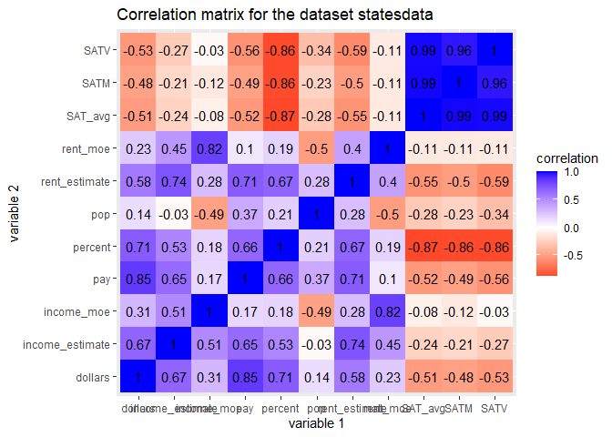<!-- -->

``` r
library(ggplot2)

#2nd plot mapping 3 variables SAT_avg on x axis, income_estimate on y axis by region
#shows up as a line plot to see how SAT score changes across region and how it affects income estimate, 
#changed default color setting, and points were set to white color, with labels on axes added 
ggplot(data= statesdata, aes(x=SAT_avg, y=income_estimate, color=region)) + 
  geom_line()+
  scale_color_manual(values=c('red', 'orange','yellow','green','blue', 'purple','pink','magenta', 'coral')) +
  geom_point(colour="white", size=2) +
  ggtitle("Line plot of SAT_avg vs. income_estimate by region") + ylab("income estimate(in $1000 dollars)") + xlab("SAT_avg score")
```

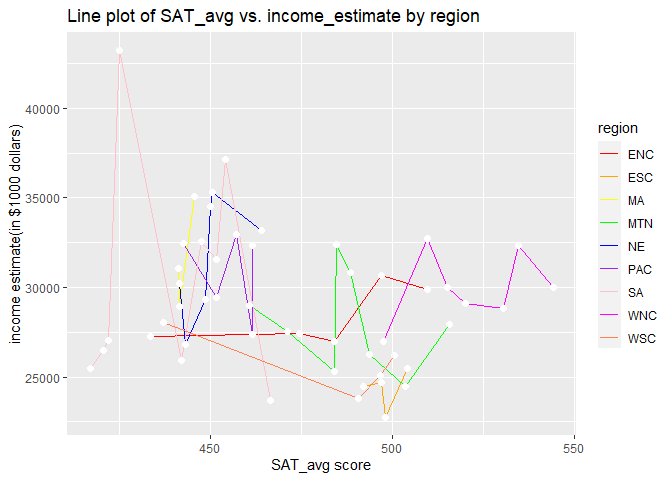<!-- -->

``` r
#3rd plot mapping 3 variables Pay(average teachers salary) on x axis, dollars(state spending on public education in $1000 per student) on y axis by region
#shows up as a scatterplot with the data points and then summary is to showcase point ranges of error bars for each different region mean
#changed default colors using scale color brewer and added title and axes
ggplot(data = statesdata) +
  geom_pointrange(
    mapping = aes(x = pay, y = dollars, color=region),
    stat = "summary",
    fun.min = min,
    fun.max = max,
    fun = median
  ) +
  scale_color_brewer(palette = "Set1")+
  ggtitle("Scatterplot of Teacher's Pay vs.State Spending per Public School Student by Region") + xlab("pay:(average teachers salary)in dollars") + ylab("dollars(state spending on public education in $1000 per student)")
```

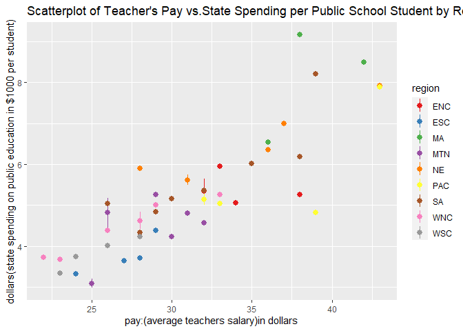<!-- --> *Findings:
The Visualizations correlation matrix disproved my hypothesis there
Wasn’t a strong correlation between SAT\_avg and rent/income as
predicted(-0.55). However, a higher SAT Score had a strong negative
correlation with percent of students graduating from high school who
took SAT(-0.87). My first ggplot of SAT avg vs income estimate grouped
by region shows the disparity of education in each state even though
region is similar. The second ggplot with stat=summary shows point error
bars for the means of the region as a whole along with the individual
data points. Its interesting to note that MA(Mid-Atlantic),NE(New
England), and PAC (Pacific) region had some states with high dollars
spent on a student’s public education and higher teacher’s salary .*

**K-means/PAM Clustering**

``` r
library(cluster)

#K-Means 
#Plotting the WSS against the number of clusters
wss <- vector()

# Find WSS for different values of k using a loop
for(i in 1:10){
temp <- states_num %>%
  select(pop,SATV, SATM, percent, dollars, pay,income_estimate, rent_estimate, income_moe, rent_moe, SAT_avg) %>%
  kmeans(.,i)
wss[i]<-temp$tot.withinss
}
# Represent the value of WSS depending on the number of clusters
ggplot() + 
  geom_point(aes(x=1:10,y=wss)) +
  geom_path(aes(x=1:10,y=wss)) +
  xlab("clusters") +
  scale_x_continuous(breaks=1:10)
```

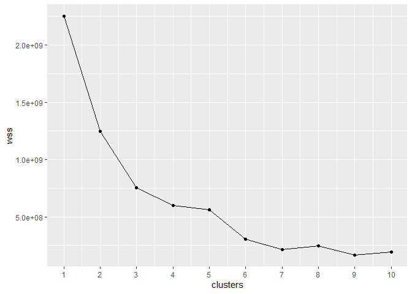<!-- -->

``` r
#it was determined that 5 clusters were optimal for the all the numeric variables taken into account based on WSS against cluster test

# clustering on all the numeric variables in statesdata
clust_data <- states_num %>%
  select(pop,SATV, SATM, percent, dollars, pay,income_estimate, rent_estimate, income_moe, rent_moe, SAT_avg)
# Use the function kmeans to find 5 clusters
kmeans1 <- clust_data %>% kmeans(5)
kmeans1
```

    ## K-means clustering with 5 clusters of sizes 1, 15, 20, 8, 7
    ## 
    ## Cluster means:
    ##         pop     SATV     SATM  percent  dollars      pay income_estimate
    ## 1 29760.000 419.0000 484.0000 45.00000 4.826000 39.00000        29454.00
    ## 2  1533.933 459.4667 512.8000 30.33333 5.290800 30.80000        30808.87
    ## 3  3336.000 452.9500 497.8000 24.65000 4.294750 27.25000        25753.55
    ## 4  4731.250 431.6250 479.2500 57.25000 6.685375 36.50000        35355.12
    ## 5 13052.857 433.2857 485.8571 38.57143 5.769143 34.28571        28443.00
    ##   rent_estimate income_moe rent_moe  SAT_avg
    ## 1     1358.0000  109.00000 3.000000 451.5000
    ## 2      953.6667  253.13333 8.066667 486.1333
    ## 3      811.5000  156.65000 4.700000 475.3750
    ## 4     1184.0000  234.87500 6.125000 455.4375
    ## 5      949.7143   89.57143 2.714286 459.5714
    ## 
    ## Clustering vector:
    ##  [1] 3 2 3 3 1 2 4 2 4 5 3 2 3 5 3 2 2 3 3 3 4 4 5 4 3 3 3 2 2 2 4 3 5 3 2 5 3 3
    ## [39] 5 2 3 2 3 5 3 2 4 4 3 2 2
    ## 
    ## Within cluster sum of squares by cluster:
    ## [1]         0  56685523  99649204 121945670  84572821
    ##  (between_SS / total_SS =  83.9 %)
    ## 
    ## Available components:
    ## 
    ## [1] "cluster"      "centers"      "totss"        "withinss"     "tot.withinss"
    ## [6] "betweenss"    "size"         "iter"         "ifault"

``` r
# Save cluster assignment as a column in your dataset
kmeansclust <- clust_data %>%
  mutate(cluster=as.factor(kmeans1$cluster))

# Made 5 visualization plots comparing 2 variables (i.e. population vs. SAT_avg) colored by final cluster assignment to observe findings
kmeansclust %>%
  ggplot(aes(pop,SAT_avg, color = cluster)) +
  geom_point()+
  ggtitle("Cluster of Population vs.SAT_Avg")
```

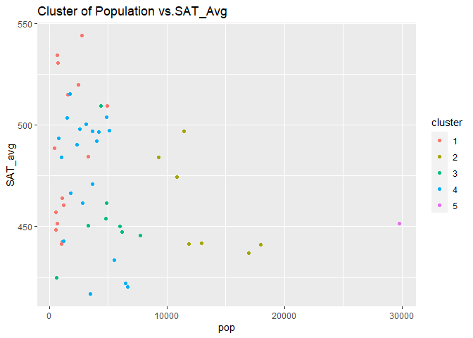<!-- -->

``` r
kmeansclust %>%
  ggplot(aes(percent,pay, color = cluster)) +
  geom_point()+
  ggtitle("Cluster of Percent(percentage of graduating high school students who take S.A.T) vs.pay")
```

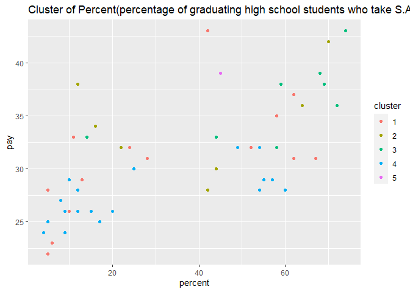<!-- -->

``` r
kmeansclust %>%
  ggplot(aes(income_estimate,rent_estimate, color = cluster)) +
  geom_point()+
  ggtitle("Cluster of Income estimate vs.Rent Estimate")
```

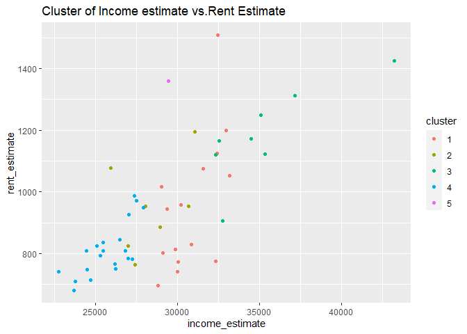<!-- -->

``` r
kmeansclust %>%
  ggplot(aes(pop,pay, color = cluster)) +
  geom_point()+
  ggtitle("Cluster of Population vs. Teachers Average Pay")
```

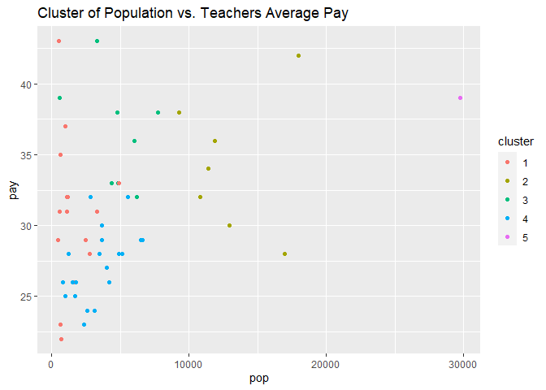<!-- -->

``` r
kmeansclust %>%
  ggplot(aes(SAT_avg,income_estimate, color = cluster)) +
  geom_point()+
  ggtitle("Cluster of SAT_Avg vs. Income Estimate")
```

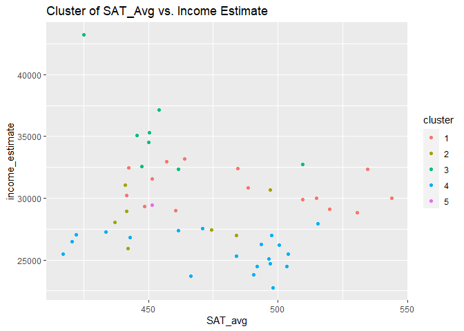<!-- -->

``` r
#PAM Method

# Number of clusters based on silhouette width (how cohesive and separated clusters are, simultaneously) index takes inaccount WSS and BSS
# create an empty vector
sil_width <- vector()

# Find the silhouette width for different values of k using a loop
for(i in 2:10){  
  pam_fit <- pam(clust_data, k = i)
  sil_width[i] <- pam_fit$silinfo$avg.width  
}

# Represent the value of silhouette width depending on the number of clusters
ggplot() +
  geom_line(aes(x=1:10,y=sil_width)) +
  labs(x = "clusters", y = "silhouette width") +
  scale_x_continuous(breaks=1:10)
```

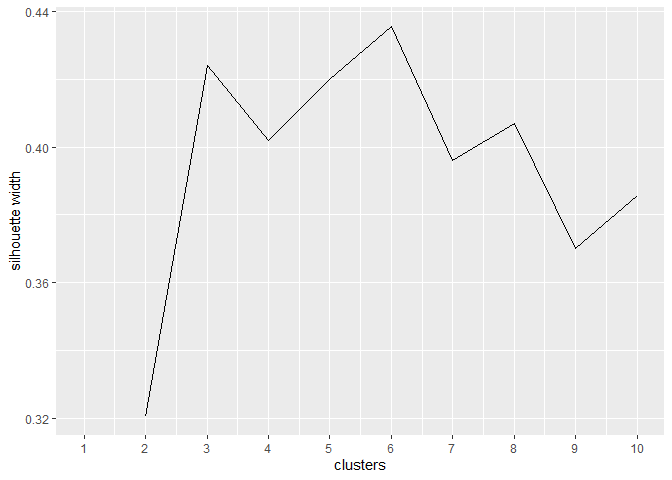<!-- -->

``` r
#highest silhouette width is 6 clusters

# Use the function pam to find 6 clusters
pam1 <- clust_data %>%
  pam(k=6)
pam1
```

    ## Medoids:
    ##      ID   pop SATV SATM percent dollars pay income_estimate rent_estimate
    ## [1,] 41  3487  397  437      54   4.327  28           25454           836
    ## [2,] 40  1003  422  461      62   6.989  37           30210           957
    ## [3,]  5 29760  419  484      45   4.826  39           29454          1358
    ## [4,] 24  4375  477  542      14   5.260  33           32734           906
    ## [5,]  9   607  409  441      68   8.210  39           43198          1424
    ## [6,] 39 11882  420  463      64   6.534  36           28923           885
    ##      income_moe rent_moe SAT_avg
    ## [1,]        123        4   417.0
    ## [2,]        259        6   441.5
    ## [3,]        109        3   451.5
    ## [4,]        189        4   509.5
    ## [5,]        681       17   425.0
    ## [6,]        119        3   441.5
    ## Clustering vector:
    ##  [1] 1 2 1 1 3 4 4 2 5 6 1 2 1 6 1 2 2 1 1 1 4 4 6 4 1 1 1 2 2 2 4 1 6 1 2 6 1 1
    ## [39] 6 2 1 2 1 6 2 2 4 4 1 4 2
    ## Objective function:
    ##    build     swap 
    ## 2176.470 2024.237 
    ## 
    ## Available components:
    ##  [1] "medoids"    "id.med"     "clustering" "objective"  "isolation" 
    ##  [6] "clusinfo"   "silinfo"    "diss"       "call"       "data"

``` r
# Save cluster assignment as a column in your dataset
pamclust <- clust_data %>%
  mutate(cluster = as.factor(pam1$clustering))

# Make a plot of data colored by final cluster assignment
pamclust %>% 
  ggplot(aes(pop,SAT_avg,color = cluster)) +
  geom_point()
```

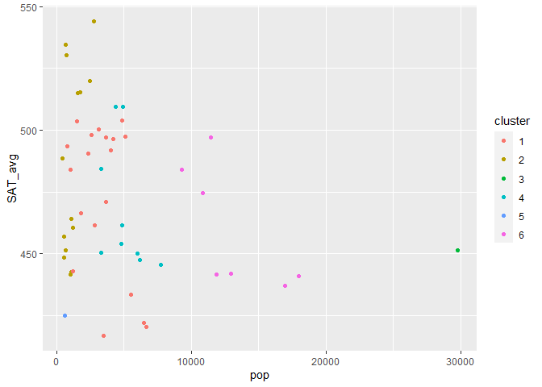<!-- -->

``` r
# Calculate the means of each variable for each cluster
pamclust %>% 
  group_by(cluster) %>%
  summarize_if(is.numeric,~ mean(.x, na.rm=T))
```

    ## # A tibble: 6 x 12
    ##   cluster    pop  SATV  SATM percent dollars   pay income_estimate rent_estimate
    ## * <fct>    <dbl> <dbl> <dbl>   <dbl>   <dbl> <dbl>           <dbl>         <dbl>
    ## 1 1        3421.  451.  496.    25.7    4.36  27.4          25639.          804.
    ## 2 2        1182.  461.  512.    30.1    5.11  30.2          30557.          951.
    ## 3 3       29760   419   484     45      4.83  39            29454          1358 
    ## 4 4        5048.  442.  494.    47.7    6.23  35.2          33546.         1110.
    ## 5 5         607   409   441     68      8.21  39            43198          1424 
    ## 6 6       13053.  433.  486.    38.6    5.77  34.3          28443           950.
    ## # ... with 3 more variables: income_moe <dbl>, rent_moe <dbl>, SAT_avg <dbl>

``` r
# Find the observations that are the final medoids
statesdata[pam1$id.med,]
```

    ##                   state region   pop SATV SATM percent dollars pay
    ## 41       South Carolina     SA  3487  397  437      54   4.327  28
    ## 40         Rhode Island     NE  1003  422  461      62   6.989  37
    ## 5            California    PAC 29760  419  484      45   4.826  39
    ## 24            Minnesota    WNC  4375  477  542      14   5.260  33
    ## 9  District of Columbia     SA   607  409  441      68   8.210  39
    ## 39         Pennsylvania     MA 11882  420  463      64   6.534  36
    ##    income_estimate rent_estimate income_moe rent_moe SAT_avg
    ## 41           25454           836        123        4   417.0
    ## 40           30210           957        259        6   441.5
    ## 5            29454          1358        109        3   451.5
    ## 24           32734           906        189        4   509.5
    ## 9            43198          1424        681       17   425.0
    ## 39           28923           885        119        3   441.5

*Findings: From the K-means plots, the population vs SAT\_Avg it further
confirms that a higher population can have a lower SAT\_avg score,
generally the less students who can graduate who took SAT can perform
better. The third plot of income vs rent estimate shows the moderate
cluster relationship between those, there is still regions of overlap.
The fourth plot shows a weak relationship between pay and population, as
it appears as vertical cluster. The fifth cluster of income estimate vs
SAT\_Avg shows weak cluster relationship. The other pam cluster is
similar to 1st K-means plot and shows similar results. THe pam
observations below indicate which serve states best as medoids. *
